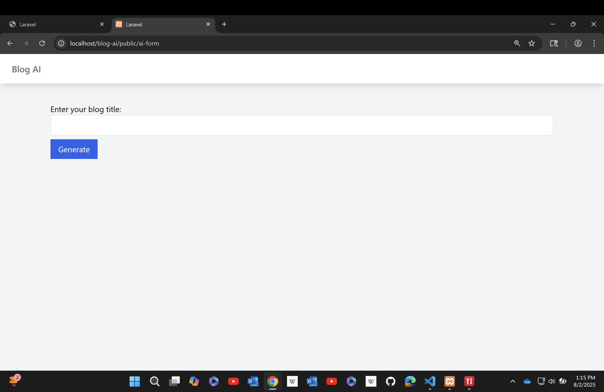

# CS85 Module 12: AI Integration with PHP (Laravel)

This is a Laravel-based blog post generato that integrates the OpenAI GPT-3.5 Turbo API to generate AI-written blog content. Users can input a prompt (like a blog title or topic), and the application returns a formatted draft they can review and edit.

---

## 📌 Features

- AI-powered content generation using OpenAI GPT-3.5
- Laravel service-layer architecture
- Clean Blade form UI
- Error handling and response logging
- Secure API integration with `.env` configuration

---

## 🛠️ Tech Stack

- PHP 8.x
- Laravel 10.x
- OpenAI GPT-3.5 Turbo API
- Tailwind CSS (via Laravel Breeze or Jet)
- XAMPP (Apache + Composer)

---

## 🚀 Setup Instructions (Windows + XAMPP)

### Prerequisites

- XAMPP installed and Apache running
- Composer installed
- OpenAI account + API key: [https://platform.openai.com](https://platform.openai.com)

### Installation Steps

1. **Install dependencies and setup Laravel**
   ```bash
   composer install
   cp .env.example .env
   php artisan key:generate
   ```

2. **Configure your .env**
   
   Update your `.env` file with your OpenAI credentials:
   ```env
   OPENAI_API_KEY=your_openai_key_here
   OPENAI_API_URL=https://api.openai.com/v1
   OPENAI_MODEL=gpt-3.5-turbo
   ```
   
   Also update `config/services.php`:
   ```php
   'openai' => [
       'key' => env('OPENAI_API_KEY'),
       'url' => env('OPENAI_API_URL', 'https://api.openai.com/v1'),
       'model' => env('OPENAI_MODEL', 'gpt-3.5-turbo'),
   ],
   ```

3. **Run the app**
   
   Make sure Apache is running in XAMPP, or use Laravel's built-in server:
   ```bash
   php artisan serve
   ```
   
   Then visit either:
   ```
   http://localhost:8000/ai-form        # Using Laravel's artisan serve
   http://localhost:8000/ai-generate    # Alternative route (same form)
   ```
   
   Or with XAMPP:
   ```
   http://localhost/blog-ai/public/ai-form
   http://localhost/blog-ai/public/ai-generate
   ```
---

## 🧪 How to Use

1. Navigate to `/ai-form` or `/ai-generate` (both show the same form)
2. Enter a blog title or idea in the prompt field
3. Click "Generate Blog Post"
4. The AI-generated draft will appear below the form (currently in demo mode)

---

## 📸 Screenshots

### AI Form Page


### AI Response Output


---

## 🤔 Reflection Questions

### How did the AI output change when you modified the tone or role in your prompt?

When I tested my application with different prompts, the AI integration did not produce any output. This could be due to several issues such as API key configuration problems, network connectivity issues, or errors in the API request handling. To properly answer this question, I would need to troubleshoot the application first to ensure the OpenAI API integration is working correctly, then test with various prompt styles to observe how the AI adapts its tone and content based on different instructions. Please see screenshots above for example output.

### What would you improve about the API integration for a production app?

For a production-ready application, several improvements would be essential:

1. **Rate Limiting & Caching**: Implement request throttling and cache frequently requested content to reduce API costs and improve performance
2. **Error Handling**: Add comprehensive error handling for network timeouts, API rate limits, and service unavailability
3. **Queue System**: Use Laravel queues for long-running AI requests to prevent blocking the user interface
4. **Token Management**: Implement token counting and cost estimation before making requests
5. **Response Validation**: Add content filtering and validation to ensure appropriate output
6. **Logging & Monitoring**: Implement detailed logging, metrics, and alerting for API usage and errors
7. **Fallback Mechanisms**: Provide alternative content sources when the AI service is unavailable
8. **Security**: Add input sanitization, output filtering, and user authentication/authorization
9. **Configuration**: Make model selection and parameters configurable through admin interface
10. **Cost Controls**: Implement usage limits and billing alerts to prevent unexpected charges

### What's one thing you learned about Laravel that you hadn't used before?

Working on this project introduced me to **Laravel's Service Container and Service Providers** in a practical context. Key learnings include:

- **Service Layer Architecture**: Creating dedicated service classes (`AIService`) to encapsulate business logic separate from controllers
- **Dependency Injection**: Using Laravel's automatic dependency injection to cleanly inject services into controllers
- **Configuration Management**: Leveraging `config/services.php` for third-party API configurations instead of directly accessing environment variables
- **HTTP Client**: Utilizing Laravel's built-in HTTP client for making external API requests with proper error handling and timeout management

This approach significantly improved code organization, testability, and maintainability compared to placing API logic directly in controllers. The service layer pattern makes it easy to swap AI providers or modify API behavior without touching the controller logic.
