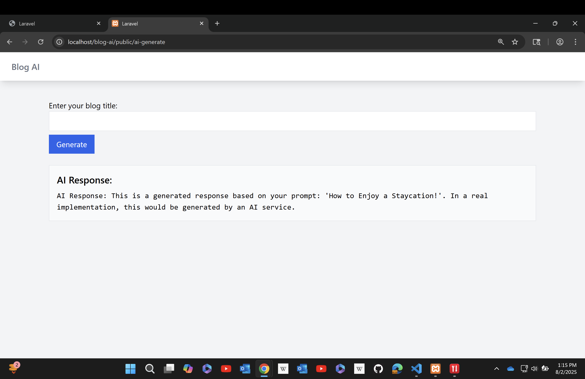

# CS85 Module 12: AI Integration with PHP (Laravel)

This is a Laravel-based blog post generato that integrates the OpenAI GPT-3.5 Turbo API to generate AI-written blog content. Users can input a prompt (like a blog title or topic), and the application returns a formatted draft they can review and edit.

---

## 📌 Features

- AI-powered content generation using OpenAI GPT-3.5
- Laravel service-layer architecture
- Clean Blade form UI
- Error handling and response logging
- Secure API integration with `.env` configuration

---

## 🛠️ Tech Stack

- PHP 8.x
- Laravel 10.x
- OpenAI GPT-3.5 Turbo API
- Tailwind CSS (via Laravel Breeze or Jet)
- XAMPP (Apache + Composer)

---

## 🚀 Setup Instructions (Windows + XAMPP)

### Prerequisites

- XAMPP installed and Apache running
- Composer installed
- OpenAI account + API key: [https://platform.openai.com](https://platform.openai.com)

### Installation Steps

1. **Install dependencies and setup Laravel**
   ```bash
   composer install
   cp .env.example .env
   php artisan key:generate
   ```

2. **Configure your .env**
   
   Update your `.env` file with your OpenAI credentials:
   ```env
   OPENAI_API_KEY=your_openai_key_here
   OPENAI_API_URL=https://api.openai.com/v1
   OPENAI_MODEL=gpt-3.5-turbo
   ```
   
   Also update `config/services.php`:
   ```php
   'openai' => [
       'key' => env('OPENAI_API_KEY'),
       'url' => env('OPENAI_API_URL', 'https://api.openai.com/v1'),
       'model' => env('OPENAI_MODEL', 'gpt-3.5-turbo'),
   ],
   ```

3. **Run the app**
   
   Make sure Apache is running in XAMPP.
   Then visit either:
   ```
   http://localhost:8080/ai-generate
   ```
   Or:
   ```
   http://localhost/blog-ai/public/ai-form
   ```
---

## 🧪 How to Use

1. Navigate to `/ai-generate` or `/ai-form`
2. Enter a blog title or idea in the prompt field
3. Click "Generate"
4. The AI-generated draft will appear below the form

---

## 📸 Screenshots

### AI Form Page


### AI Response Output

